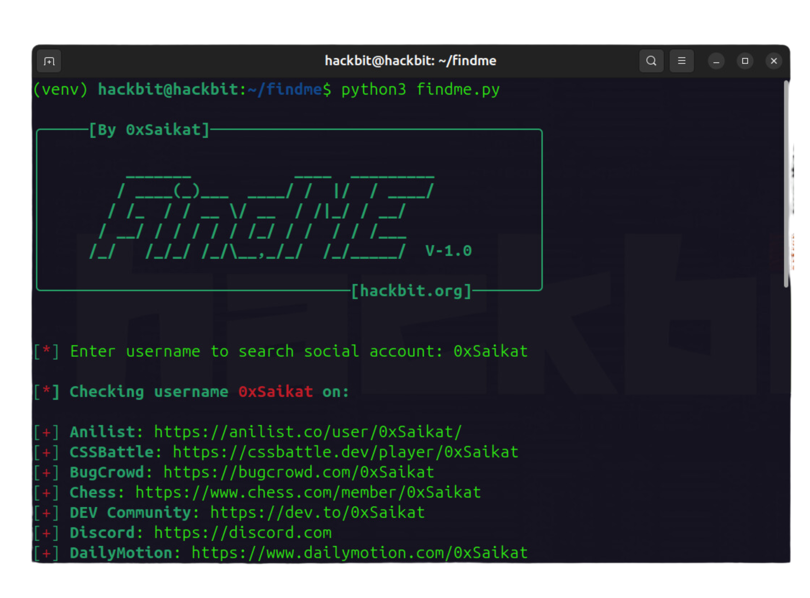

# FindME - A Powerful Tool for Social Media Account Discovery by Username.

 

FindME is a powerful and simple-to-use CLI-based tool that helps users search for social media and online platform profiles associated with a given username. Whether you're performing reconnaissance, verifying your digital footprint, or simply curious about username availability, FindME provides results quickly and efficiently.



Platforms Supported
By default, FindME searches for usernames on the following platforms:

- GitHub
- HackerOne
- Discord
- CSSBattle
- BugCrowd
- DailyMotion
- DEV Community
- Duolingo
- Anilist
- And more...

**Hunt down social media accounts by username across 400+ social networks**

## How It Works
1. Input a username when prompted.
2. FindME searches for the username across predefined platforms.
3. Displays a list of links to profiles where the username exists or is reserved.

## Installation & Usage

To use FindME, follow these steps:

1. **Clone the repository:**
   ```bash
   git clone https://github.com/0xSaikat/findme.git
   cd findme
2. **Install the required dependencies:**
   ```bash
   pip3 install -r requirements.txt

3. **Run the FindME tool:**
    ```bash
   python3 findme.py

## Use Cases:
- Cybersecurity Research: Perform reconnaissance to identify potential threats or vulnerabilities linked to a username.
- Digital Footprint Verification: Verify and track your own online presence to manage your digital identity effectively.
- Username Availability Check: Quickly assess the availability of usernames across various platforms for branding or personal use.
- Investigation Support: Assist investigators in tracking online activities or gathering public information about individuals.

## Technical Specifications:
- Lightweight: Designed to work efficiently without requiring heavy system resources.
- Cross-Platform: Compatible with major operating systems like Windows, macOS, and Linux.
- Open-Source: The tool is open-source, enabling users to review the code for transparency and contribute to its development.
- Secure and Privacy-Focused: Searches are performed securely, ensuring no personal data is stored or misused.

## About Me

I am **Sakil Hasan Saikat**, a cybersecurity enthusiast and the founder of [HackBit](https://hackbit.org). I specialize in offensive security, penetration testing, and building automated tools for cybersecurity research. My passion for ethical hacking has driven me to create several tools that contribute to the security community.

You can learn more about my work on my personal website: [https://saikat.hackbit.org](https://saikat.hackbit.org).

Connect with me on [LinkedIn](https://www.linkedin.com/in/0xsaikat/) for updates and collaborations.


## HackBit

[HackBit](https://hackbit.org) is a cybersecurity-focused organization committed to discovering vulnerabilities, creating solutions, and making the internet a safer place. Join us in our mission to secure the digital world.

### Waving the Internet Securely!

### License

This project is licensed under the MIT License - see the [LICENSE](LICENSE) file for details.

<br>
<br>
<br>

<h6 align="center">By the Hackers for the Hackers!</h6>

<div align="center">
  <a href="https://github.com/0xSaikat"></a>
  <a href="https://twitter.com/0xSaikat"></a>
</div>


