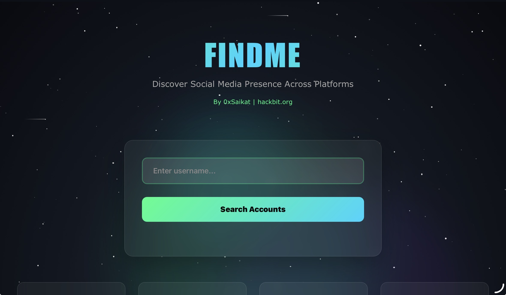
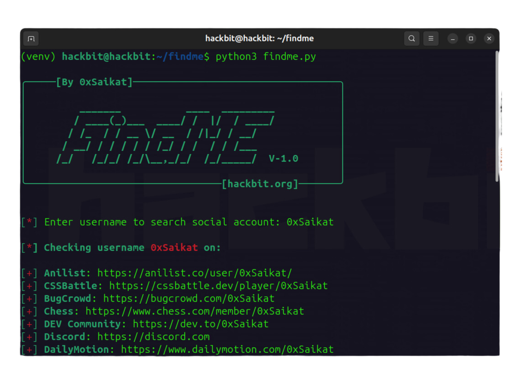

# FindME - A Powerful Tool for Social Media Account Discovery by Username


   
FindME is a powerful and simple-to-use CLI-based tool that helps users search for social media and online platform profiles associated with a given username. Whether you're performing reconnaissance, verifying your digital footprint, or simply curious about username availability, FindME provides results quickly and efficiently.




**🔍 Hunt down social media accounts by username across 400+ social networks**

## 🌐 Try It Online

**Web Version Available:** [findme.hackzar.com](https://findme.hackzar.com)

Try FindME directly in your browser without any installation!

---

## 📦 Installation

### Option 1: Install from PyPI (Recommended)

```bash
pip install findme-osint
```

### Option 2: Install from Source

```bash
git clone https://github.com/0xSaikat/findme.git
cd findme
pip install -r requirements.txt
```

---

## 🚀 Usage

### If installed via PyPI:
```bash
findme
```

### If running from source:
```bash
python3 findme.py
```

Simply enter a username when prompted, and FindME will search across 400+ platforms!

---

## 🎯 Platforms Supported

FindME searches for usernames on **400+ platforms** including:

- **Developer Platforms:** GitHub, GitLab, HackerOne, HackerRank
- **Social Media:** Twitter, Instagram, Facebook, LinkedIn
- **Gaming:** Steam, Xbox, PlayStation, Twitch
- **Creative:** Behance, Dribbble, DeviantArt, ArtStation
- **Professional:** Medium, DEV Community, Stack Overflow
- **Entertainment:** YouTube, Vimeo, DailyMotion, Spotify
- **And many more...**

---

## 💡 How It Works

1. **Input a username** when prompted
2. **FindME searches** the username across 400+ predefined platforms concurrently
3. **Displays results** with links to profiles where the username exists
4. **Real-time progress** with color-coded status indicators

---

## 🎯 Use Cases

- **🔐 Cybersecurity Research:** Perform reconnaissance to identify potential threats or vulnerabilities linked to a username
- **👤 Digital Footprint Verification:** Verify and track your own online presence to manage your digital identity effectively
- **✅ Username Availability Check:** Quickly assess the availability of usernames across various platforms for branding or personal use
- **🔎 OSINT Investigation:** Assist investigators in tracking online activities or gathering public information about individuals
- **🛡️ Security Audits:** Identify unauthorized use of usernames or brand impersonation

---

## ⚡ Features

- **🚀 Fast & Efficient:** Multi-threaded concurrent searching for quick results
- **🎨 Beautiful CLI:** Color-coded output with real-time progress bars
- **📊 Comprehensive:** Searches across 400+ social networks and platforms
- **🔒 Privacy-Focused:** No data collection, all searches are performed securely
- **🪶 Lightweight:** Minimal resource usage, works on any system
- **🌍 Cross-Platform:** Compatible with Windows, macOS, and Linux
- **📖 Open-Source:** Transparent code that you can review and contribute to
- **🌐 Web Version:** Try it online at [findme.hackzar.com](https://findme.hackzar.com)

---

## 🛠️ Technical Specifications

- **Language:** Python 3.6+
- **Architecture:** Multi-threaded concurrent HTTP requests
- **Dependencies:** requests, jsonschema, termcolor
- **Performance:** Searches 400+ platforms in under 30 seconds
- **Installation:** Available on PyPI for easy installation
- **CLI Interface:** Interactive command-line tool with progress tracking

---

## 🤝 Contributing

Contributions are welcome! Here's how you can help:

1. **Fork the repository**
2. **Create a feature branch:** `git checkout -b feature-name`
3. **Commit your changes:** `git commit -m 'Add some feature'`
4. **Push to the branch:** `git push origin feature-name`
5. **Open a Pull Request**

### Adding New Platforms

To add support for new platforms, edit `data.json` with the platform details:
```json
{
  "PlatformName": {
    "errorMsg": "Not Found",
    "errorType": "message",
    "regexCheck": "^[a-zA-Z0-9_-]{3,20}$",
    "url": "https://platform.com/{}",
    "urlMain": "https://platform.com/",
    "username_claimed": "example_user"
  }
}
```

**Fields explained:**
- `errorMsg`: The error message text to check for when username doesn't exist
- `errorType`: Either `"message"` (check response text) or `"status_code"` (check HTTP status)
- `regexCheck`: Optional regex pattern to validate username format
- `url`: Platform URL with `{}` as placeholder for username
- `urlMain`: Main homepage of the platform
- `username_claimed`: Example of a known existing username for testing

---

## 📝 Changelog

### v1.0.7 (Latest)
- ✅ Fixed data files packaging issue
- ✅ Improved file path handling for installed package
- ✅ Better error messages

### v1.0.6
- ✅ Initial PyPI release
- ✅ Support for 400+ platforms
- ✅ Multi-threaded concurrent searching
- ✅ Beautiful CLI interface

---

## 🔗 Links

- **PyPI Package:** [pypi.org/project/findme-osint](https://pypi.org/project/findme-osint/)
- **Web Version:** [findme.hackzar.com](https://findme.hackzar.com)
- **GitHub Repository:** [github.com/0xSaikat/findme](https://github.com/0xSaikat/findme)
- **Documentation:** [GitHub Wiki](https://github.com/0xSaikat/findme/wiki)
- **Report Issues:** [GitHub Issues](https://github.com/0xSaikat/findme/issues)

---

## 👤 About the Author

I am **Sakil Hasan Saikat (0xSaikat)**, a cybersecurity enthusiast and the founder of [Hackzar](https://hackzar.com). I specialize in offensive security, penetration testing, and building automated tools for cybersecurity research. My passion for ethical hacking has driven me to create several tools that contribute to the security community.

- **Website:** [saikat.hackzar.com](https://saikat.hackzar.com)
- **LinkedIn:** [linkedin.com/in/0xsaikat](https://www.linkedin.com/in/0xsaikat/)
- **GitHub:** [github.com/0xSaikat](https://github.com/0xSaikat)
- **Twitter:** [@0xSaikat](https://twitter.com/0xSaikat)

---

## 🏢 About Hackzar

[**Hackzar**](https://hackzar.com) is a cybersecurity-focused organization committed to discovering vulnerabilities, creating solutions, and making the internet a safer place. We build open-source security tools and contribute to the global cybersecurity community.

**Mission:** *Waving the Internet Securely!*

Join us in our mission to secure the digital world.

---

## 📄 License

This project is licensed under the **MIT License** - see the [LICENSE](LICENSE) file for details.

---

## ⭐ Support the Project

If you find FindME useful, please consider:
- ⭐ **Starring the repository** on GitHub
- ⚠️ **Reporting bugs** or suggesting features
- 🤝 **Contributing** to the codebase
- 📢 **Sharing** with the community

---

## 👥 Contributors


<a href="https://github.com/0xSaikat/findme/graphs/contributors">
  
</a>

---

## 📊 Stats


---

<br>

<h6 align="center">By the Hackers for the Hackers!</h6>

<div align="center">
  <a href="https://github.com/0xSaikat"></a>
  <a href="https://twitter.com/0xSaikat"></a>
  <a href="https://www.linkedin.com/in/0xsaikat/"></a>
  <a href="https://hackzar.com"></a>
</div>
